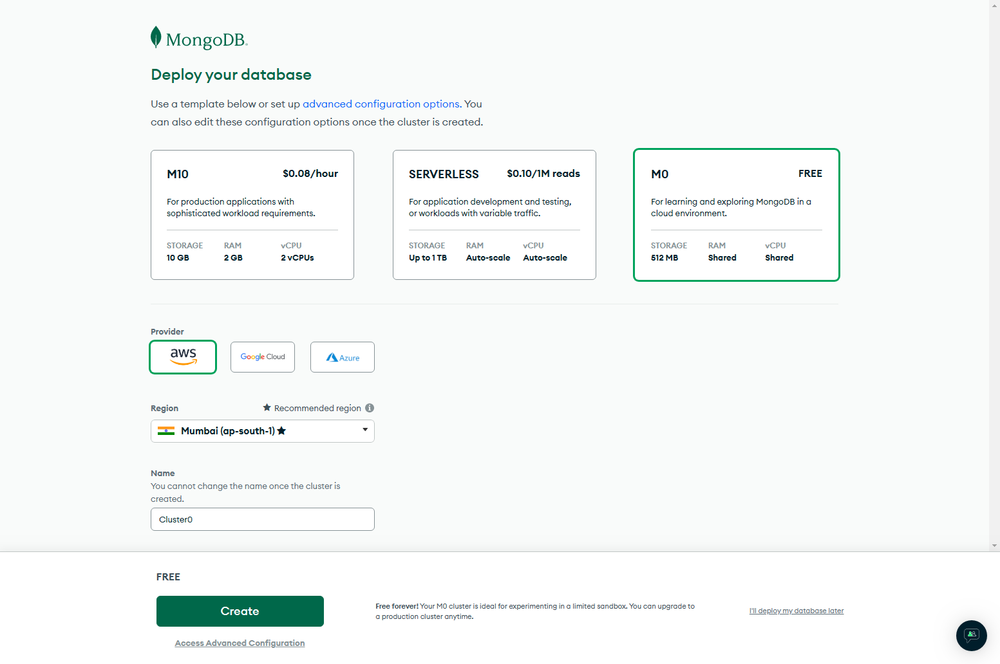
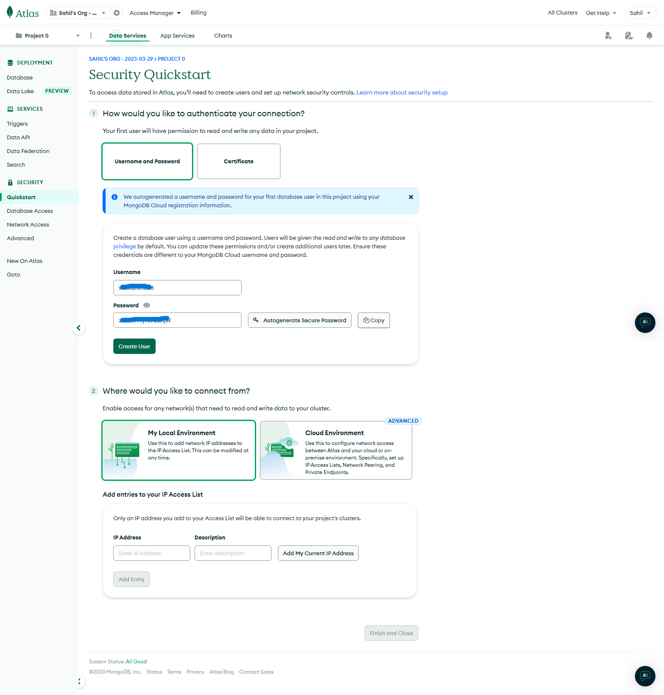
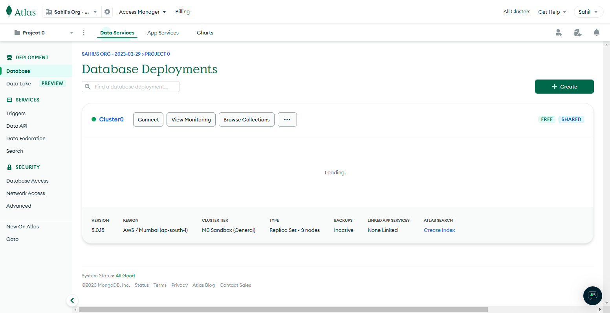
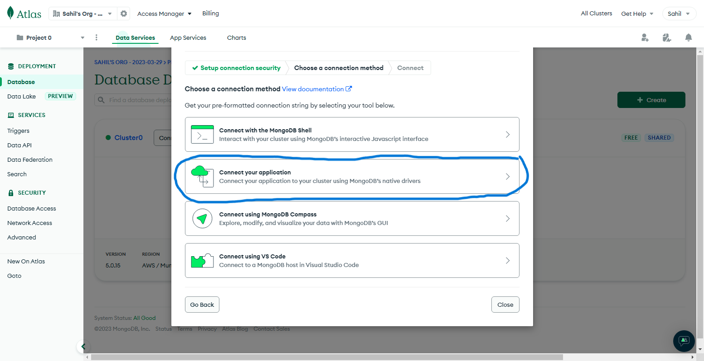
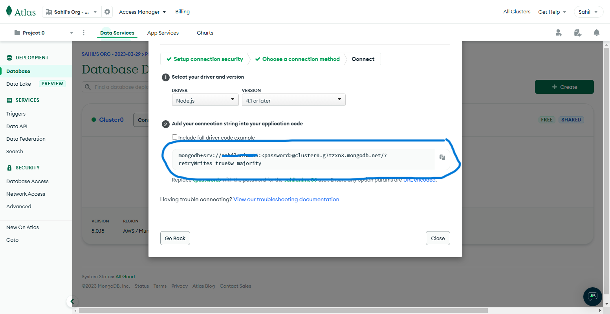

# Task Organizer using MERN

It is a simple task organizing app for creating, deleting, listing and updating task. The app is built using React for the frontend. ExpressJs and Nodejs is used for the server and MongoDb for database.

**PROCESS**

> When I started the project I first created the basic folder structure for the backend, the frontend folder structure gets automatically created with the use of npm create-react-app.  
> First I started to work on the frontend part creating the basic structure. And then started to work on the backend by connecting the database to the server.  
> After that I simultaneously started to create the api in the backend and the api calls for the frontend.  
> Once I was done with the functionality I started to work on the styling aspect of the site and later refactored the code.

---

## Requirement

Make sure to install the following files before cloning the repository.

- [NodeJs](https://nodejs.org/en/download)
- [MongoDb server](https://www.mongodb.com/try/download/community)

After installing the above files make sure to include the installed file path to the environment variables of the system.

---

## MongoDB

Create an account in [MongoDb Atlas](https://account.mongodb.com/account/register?_ga=2.104000384.1425607624.1679987626-1740544887.1679987626). Once you are on the following screen,

select the above options and press on **create**.

Next select the following option


Enter **_username_** and **_password_**, and your **_ip address_**.

> Note this username and password as we will require this when connecting to our server.

You will see the following screen, select the **connect** option.


select the following option,


Next, copy the following link, and store it with the username and password copied previously.


---

---

## Installation

1. Clone this repository

```
git clone https://github.com/Sahil25061999/task-organizer-mern-fullstack.git
```

2. Navigate to the **_client folder_** and install the dependencies by typing the following command.

```Node
npm install
```

3. Similar to the 2nd step navigate to the server folder and install the dependencies using the same command.

4. In the **_server_** folder, create **_.env_** file
   and add the **_username_**, **_password_**, and the **_link_** we copied previously.

```
MONGOURI = link
```

> Replace the `<`username`>` and `<`password`>` in the **link** with the actual username and password that we copied.

5. In order to run the file, in the **_client_** folder run the following command,

```
npm start
```

and in the **_server_** folder, run the following command,

```
npm run startServer
```
